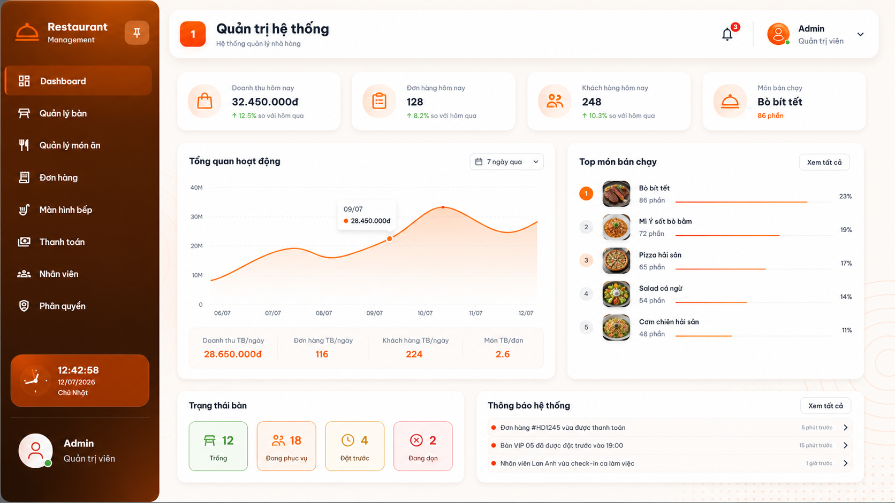

# DineMate-Restaurant-Management-System

## 📖 Introduction

Develop a smart restaurant management system that enables customers to browse menus, reserve tables, order food through QR codes, track order status in real time, make online payments, and rate their dining experience. The system also allows restaurant staff to efficiently manage menu items, categories, dining tables, reservations, orders, kitchen operations, employees, payments, and business reports through a permission-based management system.

## ✨ Features

### Customer

- User Authentication
- Browse Menu
- Search & Filter Menu
- Online Table Reservation
- QR Code Ordering
- Shopping Cart
- Real-time Order Tracking
- Online Payment
- Food & Service Rating
- AI Food Recommendation
- AI Customer Chatbot

### Restaurant Management

- Dashboard
- Permission Management
- Menu Management
- Category Management
- Table Management
- Reservation Management
- Order Management
- Kitchen Display Management
- Customer Management
- Employee Management
- Payment Management
- Revenue & Sales Statistics
- Activity Logs

---

## 🚀 Technologies

### Frontend

- Angular
- TypeScript
- Angular Material
- Bootstrap
- HTML5
- CSS3

### Backend

- ASP.NET Core Web API
- Entity Framework Core
- SQL Server

### Authentication & Authorization

- JWT Authentication
- Permission-based Authorization

### Real-time Communication

- SignalR

### AI Integration

- AI Food Recommendation
- AI Customer Chatbot

### Payment

- QR Payment

### Development Tools

- Visual Studio 2022
- Visual Studio Code
- Git
- GitHub
- Docker

##  Dashboard

  

##  Login

  

## Register

  

##  Table Management

  

## Add Table

  

##  Edit Table

  

##  Category Management

  

## Add Category

  

##  Edit Category

  

##  Delete Category

  

##  Activity Log

  

